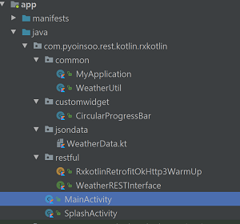
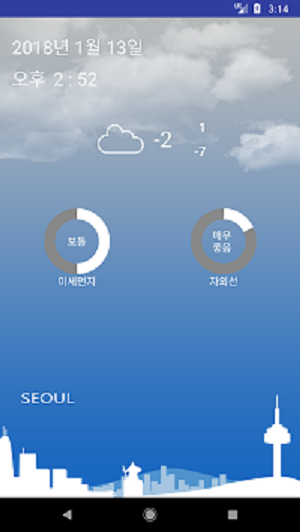

## Kotlin OkHttp3 + Retrofit2연동
* **[OkHttp3](http://square.github.io/okhttp/)**
* **[OkHttp3 + Intercepter](https://github.com/square/okhttp/wiki/Interceptors) 연동방법**
* **[OkHttp3 + Retrofit2 + Rxkotlin] 연동**
## Be sure to read
* **Developed in Android Studio 3.0**
* **Kotlin Android Extendsion**
## Project 구조

## Screenshot

## build.gradle
```gradle
  //Gson Dependencies
    compile 'com.google.code.gson:gson:2.8.2'

    /*
     * OkHttp3 Dependencies
     */
    compile 'com.squareup.okhttp3:okhttp:3.9.0'
    compile 'com.squareup.okhttp3:logging-interceptor:3.8.1'

    /**
     * Retrofit2 + Gson 연동
     */
    compile 'com.squareup.retrofit2:retrofit:2.3.0'
    compile 'com.squareup.retrofit2:converter-gson:2.3.0'

    /**
     * Rxandroid,Rxkotlin
     */
    compile 'io.reactivex.rxjava2:rxkotlin:2.2.0'
    compile 'io.reactivex.rxjava2:rxandroid:2.0.1'

    /**
     * Rxkotlin + Retrofit2 연동
     * RxJava2CallAdapterFactory를 사용하기 위함
     */
    compile 'com.squareup.retrofit2:adapter-rxjava2:2.3.0'
```
## Retrofit2 Request Interface(WeatherRESTInterface.kt)
```kotlin
/*
 * Created by pyoinsoo on 2018-01-11.
 * insoo.pyo@gmail.com
 * Rx 방식의 Retrofit 요청을 구성한다
 */
interface WeatherRESTInterface {

    /*
     * 현재 날씨를 가져온다(json data)
     */
    @GET("/weather/current/minutely")
    fun requestSKCurrentWeather(
            @Query("lat") latitude: String,
            @Query("lon") longitude: String,
            @Query("version") apiVersion: String
          ): Observable<CurrentWeather>

    /*
     * 현재 미세먼지 수치를 가져온다(json data)
     */
    @GET("/weather/dust")
    fun requestSKFineDust(
            @Query("lat") latitude: String,
            @Query("lon") longitude: String,
            @Query("version") apiVersion: String
          ): Observable<CurrentWeather>

    /*
     * 현재 자외선 지수를 가져온다(json data)
     */
    @GET("/weather/windex/uvindex")
    fun requestSKUvRays(
            @Query("lat") latitude: String,
            @Query("lon") longitude: String,
            @Query("version") apiVersion: String
         ): Observable<CurrentWeather>
}
```
## OkHttp3 + Retrofit2 + Rxkotlin연결     (RxkotlinRetrofitOkHttp3WarmUp.kt)
```kotlin
/*
 * Created by pyoinsoo on 2018-01-16.
 * okhttp3/retrofit2/Rxkotlin setup
 */
object RxkotlinRetrofitOkHttp3WarmUp {

    private val ALL_TIMEOUT = 10L
    //개발자 키
    private val SK_API_KEY = MyApplication.myApplication.
            resources.getString(R.string.sk_weather_api_key)
    private val SK_WEATHER_HOST = "http://apis.skplanetx.com/"

    private var okHttpClient: OkHttpClient
    private var retrofit: Retrofit

    init{
        /*
         * 로깅 인터셉터 연결
         */
        val httpLogging = HttpLoggingInterceptor()
        httpLogging.level = HttpLoggingInterceptor.Level.BASIC

        /*
         * OkHttp3를 설정한다
         */
        okHttpClient = OkHttpClient().newBuilder().apply {

            addInterceptor(httpLogging)
            addInterceptor(HeaderSettingInterceptor())
            connectTimeout(ALL_TIMEOUT, TimeUnit.SECONDS)
            writeTimeout(ALL_TIMEOUT, TimeUnit.SECONDS)
            readTimeout(ALL_TIMEOUT, TimeUnit.SECONDS)

        }.build()
        /*
         * Rxandroid(Rxkotlin)와 Retrofit2/OkHttp3 연동
         */
        retrofit = Retrofit.Builder().apply{
           
            addCallAdapterFactory(RxJava2CallAdapterFactory.create())
            addConverterFactory(GsonConverterFactory.create())//gson을 이용해 json파싱
            baseUrl(SK_WEATHER_HOST)
            client(okHttpClient)

        }.build()

    }
    /*
     *  Request Header를 세팅하는 Interceptor
     *  요청을 실행할 때 마다 다음의 코드로
     *  Http Header를 세팅한다
     */
    private  class HeaderSettingInterceptor : Interceptor {

        @Throws(IOException::class)
        override fun intercept(chain: Interceptor.Chain): Response {

            val chainRequest = chain.request()

            val request = chainRequest.newBuilder().apply{
                addHeader("Accept", "application/json")
                addHeader("appKey",SK_API_KEY)
            }.build()

            return chain.proceed(request)
        }
    }

    /*
     * interface로 선언된 Retrofit REST 객체를 생성하여 넘긴다
     */
    fun <T> createSKWeatherRESTService(retrobitRESTClass: Class<T>): T {
        return retrofit.create(retrobitRESTClass)
    }

}
```
## Rx방식으로 날씨(미세먼지,자외선)정보 요청하는 코드(MainActivity.kt)
```kotlin
override fun onResume() {
        super.onResume()
        /*
         * 요청을 보낼 Retrofit interface를 생성해 가져온다
         */
        val restClient: WeatherRESTInterface =
              RxkotlinRetrofitOkHttp3WarmUp.
                      createSKWeatherRESTService(WeatherRESTInterface::class.java)

        /*
         * 현재 날씨를 백그라운드 쓰레드를 이용해
         * json을 가져오고 데이터객체로 변환한다
         */
        var observer: Observable<CurrentWeather> =
                restClient.requestSKCurrentWeather(latitude,logitude,apiVersion)

        var dispose = observer.subscribeOn(Schedulers.io())
                              .observeOn(AndroidSchedulers.mainThread())
                              .subscribe({
                                  setUICurrentWeather(it)  //it은 CurrentWeather data객체
                                }, { t ->
                                    errorMessage(t.toString())
                                })
        /*
         * 해제할 RX자원을 추가한다
         */
        rxDisposable.add(dispose)

        /*
         * 미세먼지 정보를 가져오고 자원해제를 위해 추가한다
         */
        observer = restClient.requestSKFineDust(latitude,logitude,apiVersion)
        dispose = observer.subscribeOn(Schedulers.io())
                          .observeOn(AndroidSchedulers.mainThread())
                          .subscribe({
                              setUIDust(it) //데이터객체를 UI업데이트를 위해 넘긴다
                          }, { t ->
                              errorMessage(t.toString())
                          })
        rxDisposable.add(dispose)

        /*
         * 자외선 정보를 가져오고 자원해제를 위해 추가한다
         */
        observer = restClient.requestSKUvRays(latitude,logitude,apiVersion)
        dispose = observer.subscribeOn(Schedulers.io())
                          .observeOn(AndroidSchedulers.mainThread())
                          .subscribe({
                               setUIUvindex(it) //데이터객체를 UI업데이트를 위해 넘긴다
                           }, { t ->
                               errorMessage(t.toString())
                           })
        rxDisposable.add(dispose)
    }
    /*
     * Activity Life Cycle을 이용해 Rx자원을 해제한다
     */
    override fun onPause(){
        super.onPause()
        when {
            !rxDisposable.isDisposed -> rxDisposable.dispose()
        }
    }
```
## 현재날씨를 요청하는 URL
* **http://apis.skplanetx.com/weather/current/minutely?lat=37.572978&lon=126.989061&version=1**
* **서버로 부터 넘어온 JSON(화면에 출력할 정보만 data 클래스로 구현)**
```json
{
  "weather": {
    "minutely": [
      {
       ,,,
       ,,,
        "sky": {
          "code": "SKY_A07",//현재 하늘 상태 코드
          "name": "흐림"
        },
        ,,,
        "temperature": {
          "tc": "-1.60", //현재 온도
          "tmax": "1.00",//오늘 최고 온도
          "tmin": "-7.00"//오늘 최저 온도
        },
        ,,,
      }
    ]
  },
  ,,,
  ,,,
}
```
* **위 JSON의 data class**
```kotlin
data class CurrentWeather(val weather:Weather)

class Weather{
    //현재 날씨(오늘 최저/최고)
    var minutely:ArrayList<Minutely>? = null
    ,,,
    ,,,
}
//현재 날씨에 해당하는 JSON값을 객체화
//실제 날씨정보가 들어 있는 JSON값을 객체화
data class Minutely(
        val sky:Sky,
        val temperature:Temperature
)
data class Sky(val code:String, val name:String)
data class Temperature(val tc:String, val tmax:String, val tmin:String)
```
## 미세먼지를 요청하는 URL
* **http://apis.skplanetx.com/weather/dust?lat=37.572978&lon=126.989061&version=1**
* **서버로 부터 넘어온 JSON(화면에 출력할 정보만 data 클래스로 구현)**
```json
{
  "weather": {
    "dust": [
       ,,,
       ,,,
        "pm10": {
          ,,,
          "value": "57.75" //현재 미세먼지 수치
        }
      }
    ]
  },
  ,,,
  ,,,
}
```
* **위 JSON의 data class**
```kotlin
data class CurrentWeather(val weather:Weather)

class Weather{
    ,,,
    //미세먼지
    var dust : ArrayList<Dust>? = null
    ,,,
}
//미세먼지 데이터 값
data class Dust(val pm10:Pm10)
data class Pm10(val value:String)
```
## 자외선정보를 요청하는 URL
* **http://apis.skplanetx.com/weather/windex/uvindex?lat=37.572978&lon=126.989061&version=1**
* **서버로 부터 넘어온 JSON(화면에 출력할 정보만 data 클래스로 구현)**
```json
{
  "weather": {
    "wIndex": {
      "uvindex": [
        {
          ,,,
          "day00": { //현재 자외선 정보
            ,,,
            "index": "10.00",//현재 자외선 값
            ,,,
          },
          ,,,
        }
      ],
      ,,,
    }
  },
  ,,,
  ,,,
}
```
* **위 JSON의 data class**
```kotlin
data class CurrentWeather(val weather:Weather)

class Weather{
    ,,,
    ,,,
    //자외선
    var wIndex : WIndex? = null
}
//자외선 JSON값을 객체화
data class WIndex(val uvindex:ArrayList<UvIndex>)
data class UvIndex(val day00:Day00)
data class Day00(val index:String)
```

* **본 코드의 개발키(appKey)는 sk 텔레콤에서 제공(1일 10000콜 제한)합니다**
